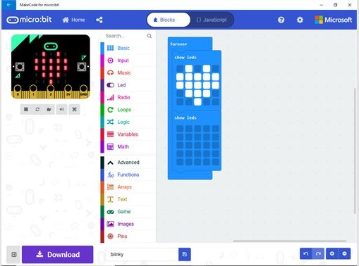

## ¿Qué es [micro:bit](http://microbit.org)?

micro:bit es una pequeña computadora programable, diseñada para hacer ¡fáciles y divertidos! enseñanza y aprendizaje.

Nos permite trabajar la computción física (haciendo tangible y "tocable") y el pensamiento computacional de una forma sencilla

Beneficiada de la experiencia de otros muchos sistemas similares anteriores (como Arduino o Raspberry pi) incluye en una pequeña tarjeta una gran cantidad de sensores, leds y botones, permitiendonos hacer una gran cantidad de proyectos distintos usando sólamente la tarjeta micro:bit

1. Botón A y Botón B
1. 5x5 leds rojos
1. Conectores para pinza de cocodrilo P0, P1, P2 (GPIO)
1. Conector 3V
1. Conector GND

1. Antena de radio y bluetooth
1. Procesador y sensor de temperatura
1. Brújula
1. Acelerómetro
1. Pines (GPIO)
1. Conector microUSB (alimentación y carga de programas)
1. Led de alimentación y/o programación
1. Botón reset
1. Conector de alimentación (2 x pilas 1.5V)
1. Chip USB

(Tomado de [Overview de microbit.org](https://microbit.org/get-started/user-guide/overview/))

## Programación

Podemos programarla usando bloques con el editor **[MakeCode](https://makecode.microbit.org)**

o **[Scratch](https://scratch.mit.edu/microbit)**

o con lenguajes de programación como **[Python](https://python.microbit.org/v/2)**, Javascript,  e incluso con el C de Arduino

Trabajar con Scratch permite mezclar parte de la funcionalidad de nuestra micro:bit (botones, leds, acelerómetro y conexión a los pines 0,1 y 2) con el resto de posibilidades de Scratch: personajes, sonidos, dibujar en pantalla, vídeo, música,... Perdemos algunas de las características de micro:bit como la brújula y el sensor de temperatura pero ganamos en interacción.

Para usar toda la funcionalidad de micro:bit debemos usar el editor de bloques de MakeCode o python.

Para hacerlo también podemos usar tanto ordenadores como tablets.
