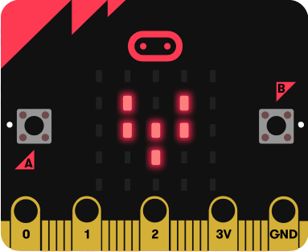

# Taller micro:bit para el Museo de las Ciencias de Granada

 by @javacasm

En este taller vamos a  ...
* Aprender qué es micro:bit y para qué podemos usarla
* Programar micro:bit con bloques usando [MakeCode](https://makecode.microbit.org/)
* Conectar sensores con los que mediremos temperatura, luz y sonido
* Controlar motores 
* Encender y apagar luces
* Producir sonidos

Para ello usaremos la misma placa

Para ello usaremos la placa [micro:bit](https://microbit.org/) 

y el [Kit de Iniciación a la electrónica de MonkMakes](http://www.monkmakes.com/mb_kit.html) que tiene los siguientes componentes:
* Placa de sensores de sonido, luz y temperatura
* Relé de estado sólido
* Motor
* Luz incandescente
* Altavoz

## [¿Qué es micro:bit?](./QueEsMicrobit.md)

## [Programando micro:bit con MakeCode](./Taller.md)
