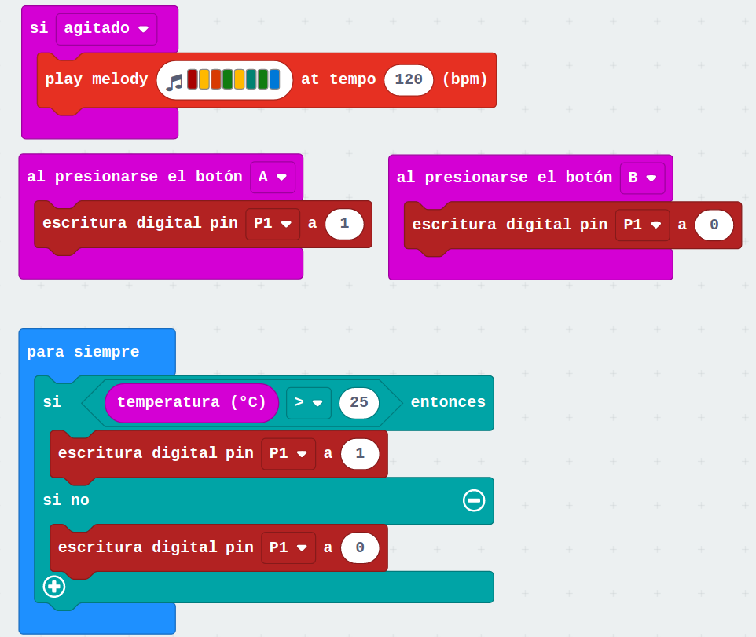

# Programación con bloques de Micro:bit

Vamos a programar nuestra micro:bit con bloques usando el editor de  [Makecode](https://makecode.microbit.org)

Si no te aparece en tu idioma, puedes cambiarlo pulsando el icono del engraje arriba a la derecha y seleccionar el idioma que prefieras

## IDE/Entorno de programación

Simulador |  Paletas | lienzo

[Primer Proyecto: iconos](https://makecode.microbit.org/_E3Pe8zJRaXVg)

Damos nombre a nuestro programa

Simulador

Descargamos y copiamos a la unidad Microbit

## Haciendo ruído

[Música](https://makecode.microbit.org/_Rsfe6X6vMED1)

Vemos que el simulador nos indica que hace falta conectar unos cascos/altavoces

Usaremos el Kit de de MonkMakes

[Vídeo: Reproduciendo música al agitar micro:bit](https://youtu.be/VwGuElgN2t8)

## Controlando corrientes y potencia externa: interruptor electrónico

Circuito eléctrico bombilla

Ponemos un interuptor hecho con cables

Insertamos un **Relé** (interruptor electrónico)

Conectamos la microbit y hacemos el programa para encender y apagar con los botones A y B

Si queremos controlar un motor/ventilador en lugar de la bombilla, sólo tenemos que cambiar la bombilla por el motor 

[Música + Ventildor](https://makecode.microbit.org/_9cCRiFb7C2ys)

[Proyecto: Música, Ventilador y termostato](https://makecode.microbit.org/_DzJHtaPoT4dT)

[Vídeo: Ventilador controlado con termostato usando micro:bit](https://youtu.be/9PxjRF-k8-g)

