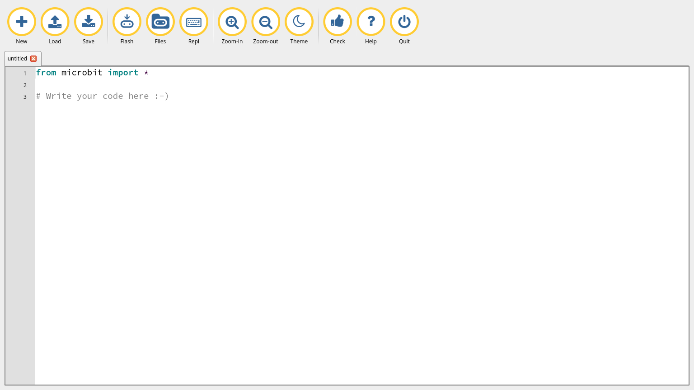

## Python

[Referencia python](http://microbit.org/es/guide/python/)

[Introducción](http://microbit-micropython.readthedocs.io/en/latest/tutorials/introduction.html)

## Proceso de compilación

El proceso es escribimos un código en un fichero .py que se convertirá en un fichero .hex que podremos pasar a microbit

### Editor web online
Al pulsar descargar se descarga el fichero hex que copiaremos en el disco microbit

#### Editor

http://python.microbit.org/editor.html

http://python.microbit.org/v/1

#### Editor Mu

Editor sencillo escrito en python y disponible para Windows, OSX, Linux y  Raspberry Pi.  

[Descarga](https://codewith.mu/)

